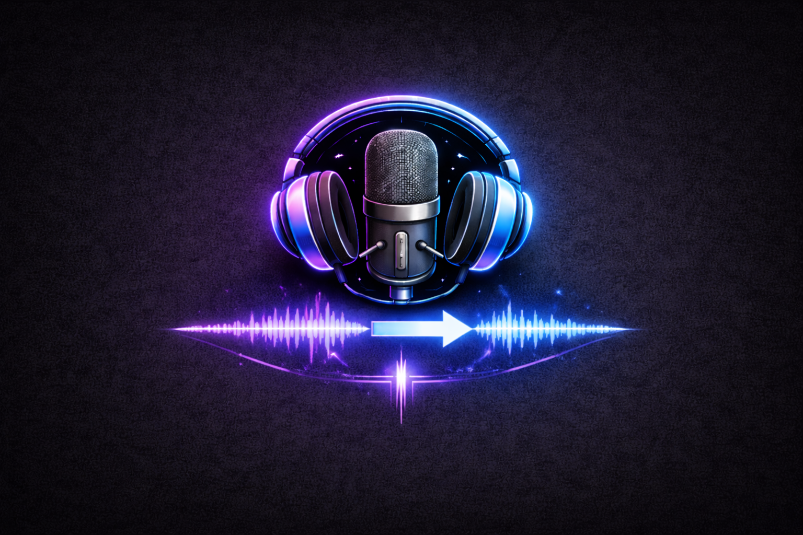

# Audio Dubbing Pipeline

An automated audio dubbing pipeline that translates movie audio from English to another language (e.g., Chinese) with natural speech synthesis. The system handles complex multi-speaker scenarios with speech overlap detection and intelligent audio mixing.



## Project Overview

This pipeline takes an input audio file, separates it into speaker tracks, detects overlapping speech, transcribes the content, translates it to a target language, generates dubbed audio using voice cloning, and finally mixes everything back together.


## Sample Audio Comparison

Listen to the raw English input vs the final automated Chinese output:

**Original Audio (English):**
[🔊 Listen to English Audio](https://gabalpha.github.io/read-audio/?p=https://raw.githubusercontent.com/Jit-Roy/Movie_Dub/test/Audio_Samples/Podcast.mp3)

**Dubbed Output (Chinese):**
[🔊 Listen to Chinese Dub](https://gabalpha.github.io/read-audio/?p=https://raw.githubusercontent.com/Jit-Roy/Movie_Dub/test/Audio_Samples/Podcast_Chinese_Dubbed.mp3)

## Pipeline Architecture

The dubbing pipeline consists of 8 main steps:

### Step 1: Vocal-Music Separation
Separates the input audio into vocal and music tracks to process speech independently from background music.

**Model Used**: Roformer-based separator (model_bs_roformer_ep_317_sdr_12.9755.ckpt)
- Isolates human speech from background music
- Preserves audio quality while removing musical components
- Allows independent processing of speech for translation

### Step 2: Overlap Detection
Detects regions where multiple speakers are talking simultaneously, which require special handling.

**Model Used**: pyannote/segmentation-3.0 (HuggingFace)
- Requires HF token authentication (gated model)
- Identifies overlapping speech segments
- Flags segments that need speaker separation for clarity

### Step 3: Speaker Diarization
Identifies and separates individual speakers in the audio, assigning each segment to the correct speaker.

**Model Used**: NVIDIA NeMo speaker diarization model
- Extracts speaker embeddings using ECAPA-VoxCeleb
- Clusters audio segments by speaker identity
- Generates speaker-specific audio tracks

### Step 4: Overlapping Speaker Separation (Conditional)
For segments with detected overlaps, separates individual speakers using source separation.

**Model Used**: Lightendale/wsj0_2mix_skim_noncausal (speaker separation)
- Only runs if overlapping speech is detected
- Separates mixed voices into individual speaker tracks
- Matches separated voices back to original speakers using embeddings

### Step 5: Speaker Identification and Matching
Matches separated speaker tracks to the original diarization speakers using speaker embeddings.

**Model Used**: ECAPA-VoxCeleb speaker embedding extractor
- Compares speaker embeddings to match separated voices
- Uses configurable threshold (default 0.60)
- Re-integrates separated speakers into main pipeline

### Step 6: Automatic Speech Recognition (ASR)
Transcribes audio content with precise timing information for each segment.

**Model Used**: Whisper-small (OpenAI)
- Transcribes speech to text with timestamp information
- Provides segment boundaries (start/end times)
- Extracts English text from audio

### Step 7: Translation
Translates transcribed English text to target language (Chinese) with duration-aware constraints.

**Models Available**: 
1. **Qwen3-0.6B** (Default local LLM)
   - Lightweight 600M parameter language model
   - Takes duration guidance into account
   - Generates character counts matching expected TTS timing
   - Token limit: 32,768 (full model capacity)
   - Targets approximately 5 characters per second for natural speech pacing
   - <span style="color:red">**Warning:** I have personally tested that the smaller Qwen 0.6B model hallucinates sometimes (especially on ultra-short audio segments). It's better to use higher size models for stable production translations.</span>

2. **Gemma-3-27b-it** (via Google GenAI API)
   - Cloud-based 27B parameter model for highly accurate translations
   - Eliminates translation hallucinations on ultra-short audio segments
   - Requires `--llm-provider gemma` and your `--genai-key` passed as arguments

### Step 8: Text-to-Speech (TTS) and Audio Mixing
Generates dubbed audio in target language with voice cloning, performs time-stretching for timing alignment, and mixes all tracks together.

**Models Used**:
- Qwen3-TTS-12Hz-0.6B-Base: Generates speech with voice cloning
  - Reference audio extraction (7 seconds from original speaker)
  - Neural vocoder for natural speech synthesis
  - Sample rate: 12kHz baseline, resampled to 16kHz for pipeline
  
- Praat TD-PSOLA: Pause-aware time-stretching
  - Adjusts generated audio duration to match original segment timing
  - Intelligently handles pauses to avoid distortion
  - Speed adjustment bounds: 0.4x to 2.5x (skips extreme stretching)

## Key Components

### Core Modules

- `main.py`: Orchestrates the entire pipeline with caching and step management
- `Vocal_Music_Separation.py`: Separates vocals from background music
- `Speech_Overlap.py`: Detects overlapping speech regions
- `Speaker_Diarization.py`: Identifies and tracks speakers
- `Speaker_Separation.py`: Separates overlapping speakers
- `Speaker_Identification.py`: Matches speakers using embeddings
- `ASR.py`: Transcribes audio to text with timing
- `Qwen3llm.py`: Translates text with duration awareness
- `Qwen3tts.py`: Generates dubbed audio with voice cloning
- `Reference_Extraction.py`: Extracts speaker reference audio
- `audio_adjustment.py`: Performs pause-aware time-stretching
- `helper.py`: Utility functions for audio handling

## Requirements

- Python 3.11+
- HuggingFace API token (for pyannote/segmentation-3.0 model)

## Installation

1. Clone the repository
2. Install dependencies: `pip install -r requirements.txt`
   > <span style="color:red">**Note:** Sometimes running `pip install -r requirements.txt` may give a setup tools dependency error. In that case, manually install the libraries via `pip install <library>` in the exact order they are listed in the `requirements.txt` file.</span>
3. Set up .env file with HF token: `hf_token=your_token_here`

## Usage

Basic usage:

```bash
python main.py \
    --input-audio "podcast.wav" \
    --target-language "Chinese" \
    --llm-provider "gemma" \
    --genai-key "your_genai_key" \
    --hf-token "your_hf_token" \
    --temp-dir "temp"
```

Or store the token in `.env` file and run:

```
python main.py --input-audio <path_to_audio> --target-language Chinese
```

The output file `final_mix.wav` will be generated in the current directory.

## Caching System

The pipeline uses a multi-layer caching system to avoid reprocessing:

- Vocal/Music separation cached
- ASR transcriptions cached
- Translations cached
- TTS generation cached per segment
- Speaker reference audio cached

To force reprocessing, delete the relevant cache files in `temp/cache/`.

## Key Technical Decisions

### Duration-Aware Translation

The pipeline calculates target character counts based on expected TTS timing:
- Target = segment duration (seconds) × 5 characters/second
- LLM receives both the duration and character target as guidance
- Ensures generated audio duration matches original segment timing

### Time-Stretching Strategy

- Generated TTS audio is stretched to match original segment duration
- Uses Praat TD-PSOLA algorithm for pause-aware stretching
- Skips if stretch rate exceeds 2.5x or falls below 0.4x (to avoid artifacts)
- Intelligently preserves pauses to maintain naturalness

## Limitations and Known Issues

1. Time-stretch bounds (0.4x-2.5x) may cause audio gaps if exceeded
2. Voice reference audio quality impacts final TTS output
3. Character density assumption (5 chars/sec) may vary by language


## License

See [LICENSE](LICENSE) file for details.